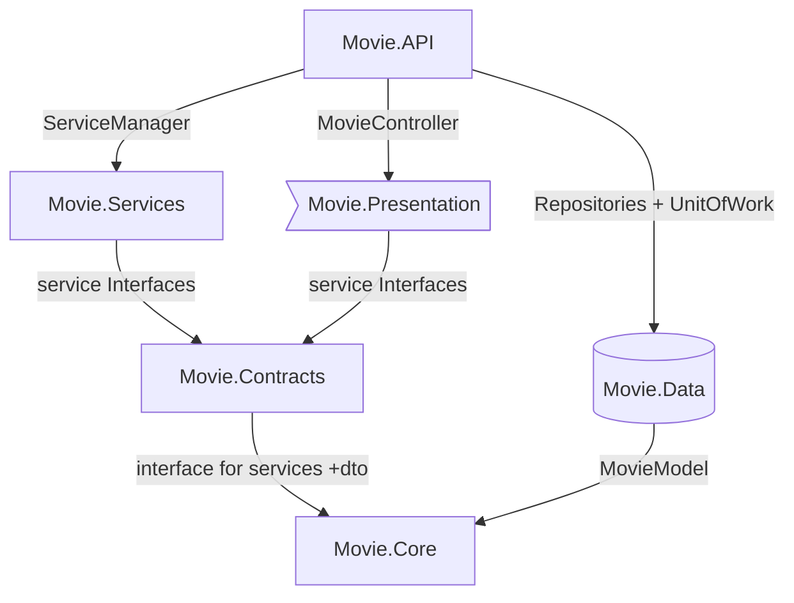

Basic Api for storing movies made with ASP.NET using SQLite.

Uses Repository pattern and Unit Of Work pattern for easy modularity and possibility for future testing.

## Diagram

```mermaid
flowchart
API[Movie.API] -->|ServiceManager| Services
Services[Movie.Services] -->|service Interfaces| Contracts
Presentation>Movie.Presentation] -->|service Interfaces| Contracts
Contracts[Movie.Contracts] -->|interface for services +dto| Core[Movie.Core]
Data[(Movie.Data)] -->|MovieModel| Core
API -->|MovieController| Presentation
API -->|Repositories + UnitOfWork| Data
```
